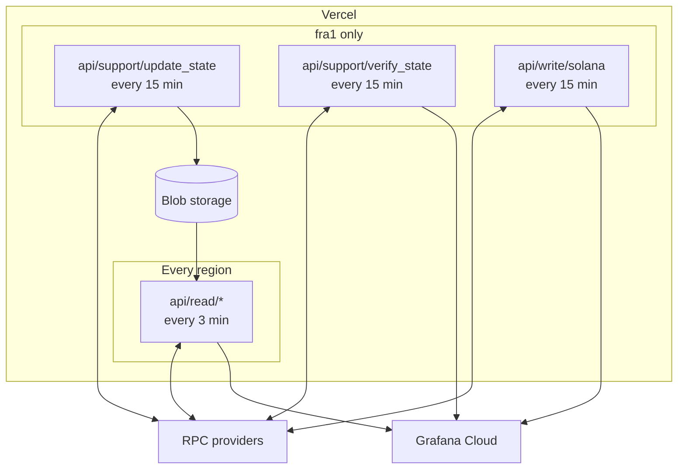

# Chainstack Compare: RPC probes

Vercel cron functions that probe RPC providers across blockchains and regions and push the results to Grafana Cloud. The data feeds [Chainstack Compare](https://compare.chainstack.com); the page itself lives in [performance-tool-client](https://github.com/chainstacklabs/performance-tool-client).

📊 [Live dashboard](https://chainstack.grafana.net/public-dashboards/65c0fcb02f994faf845d4ec095771bd0?orgId=1) | 📚 [Documentation](https://docs.chainstack.com/docs/chainstack-compare-dashboard)

Chains: Ethereum, Base, Arbitrum, BNB Smart Chain, Solana, Hyperliquid, Robinhood, Arc.
Regions: Frankfurt (fra1), US West (sfo1 and pdx1), Singapore (sin1), Tokyo (hnd1).

## What gets measured

Most series share the metric `response_latency_seconds` and differ by the `metric_type` tag:

- Latency — HTTP RPC method latency per provider, plus WebSocket new-block latency on Ethereum. Failed calls are written as `0` with `response_status="failed"`.
- `block_number` — the block each provider reported, for lag tracking.
- `balance_observed` — a hash of the balance (Solana: account state) each provider returns for a fixed address at the same block. Matching hashes mean the providers agree.
- `balance_verified` — on Ethereum, Arbitrum, BNB Smart Chain, and Robinhood, the same balance proven with `eth_getProof` against a stateRoot several providers agree on, so each provider's answer can be checked for correctness.

Solana transaction landing time goes to `transaction_landing_latency`.

Metrics are pushed in Influx line protocol. Outside production (`VERCEL_ENV` not `production`) every metric name gets a `dev_` prefix.

## Architecture



`update_state` caches recent block numbers and transaction hashes in Vercel Blob so every region queries the same data. `verify_state` picks its own block and does not use the cache.

The Grafana dashboards, including the provider score panel, are version-controlled in [`dashboards/`](./dashboards) with a sync tool. See its README.

## Configuration

Environment variables are listed in [`.env.local.example`](.env.local.example): Grafana push credentials, `CRON_SECRET`, Vercel Blob credentials, and `SOLANA_PRIVATE_KEY` for the landing test.

Endpoints go in the `ENDPOINTS` environment variable as JSON. Locally, the test scripts load `endpoints.json` instead (start from [`endpoints.json.example`](endpoints.json.example)).

```json
{
  "providers": [
    {
      "blockchain": "Ethereum",
      "name": "Chainstack",
      "http_endpoint": "https://...",
      "websocket_endpoint": "wss://..."
    },
    {
      "blockchain": "Solana",
      "name": "Chainstack",
      "http_endpoint": "https://...",
      "tx_endpoint": "https://..."
    }
  ]
}
```

- `blockchain` — chain name, case-insensitive
- `name` — provider label in metrics
- `http_endpoint` — HTTP RPC URL
- `websocket_endpoint` — optional, WebSocket URL for block latency (Ethereum)
- `tx_endpoint` — optional, Solana only; adds a second `<name>_tx` provider for landing tests

Every chain listed in `SUPPORTED_BLOCKCHAINS` (`api/support/update_state.py`) needs a Chainstack entry in each region's `ENDPOINTS`. If one is missing, `update_state` fails for all chains in that region.

## Development

```bash
uv sync
cp .env.local.example .env.local
cp endpoints.json.example endpoints.json

uv run python tests/test_api_read.py      # local server for one api/read handler; edit the import to switch chain
uv run python tests/test_update_state.py
uv run python tests/test_api_write.py
```

Checks: `uv run ruff format .`, `uv run ruff check .`, `uv run mypy .` (strict). Requires Python 3.10+.

Before a dependency or `vercel*.json` change, `uv run scripts/vercel_build_check.py [--config vercel.<region>.json]` copies the files a deploy would upload (`.vercelignore` is an allow-list) to a temporary directory, fails if any of them is not function code or deploy config, runs `vercel build` there and imports every function from the resulting bundle on Vercel's Python version. It deploys nothing, pulls no environment variables and makes no RPC calls; it needs the Vercel CLI and a linked `.vercel/project.json`.

### Adding a chain

1. `metrics/<chain>.py` — metric classes.
2. `api/read/<chain>.py` — handler listing them.
3. `config/defaults.py` — `BLOCK_OFFSET_RANGES`.
4. `api/support/update_state.py` — `SUPPORTED_BLOCKCHAINS`; for EVM chains also the EVM tuple in `common/state/blockchain_fetcher.py`.
5. For data correctness on an EVM chain: `VERIFY_BLOCK_OFFSET_RANGES` in `config/defaults.py`, and the chain's `probe_address` in `metrics/<chain>.py` copied into `PROBE_ADDRESSES` in `api/support/verify_state.py`. The dashboards join on it, so the two must match.
6. Cron entries in `vercel.json` and each `vercel.<region>.json` the chain runs in.
7. Add the chain's endpoints to every region's `ENDPOINTS` before deploying.

A new chain emits nothing until `update_state` has run once, up to 15 minutes after deploy.

## Deployment

Each region is a separate Vercel project with its own config file. Vercel runs every cron in `vercel.json` in every project, so per-region files keep each project's cron list to what it needs (Pro allows 40 crons).

The Vercel CLI doesn't reliably honor `--local-config`, so copy the region file over `vercel.json` before deploying:

```bash
vercel link --project chainstack-rpc-dashboard-germany        && cp vercel.fra1.json vercel.json && vercel --prod
vercel link --project chainstack-rpc-dashboard-us-west        && cp vercel.sfo1.json vercel.json && vercel --prod
vercel link --project chainstack-rpc-dashboard-us-west-pdx1   && cp vercel.pdx1.json vercel.json && vercel --prod
vercel link --project chainstack-rpc-dashboard-singapore      && cp vercel.sin1.json vercel.json && vercel --prod
vercel link --project chainstack-rpc-dashboard-japan          && cp vercel.hnd1.json vercel.json && vercel --prod
git checkout vercel.json
```

After a deploy, check **Settings** > **Crons** in each project lists only the expected crons.

- `update_state`, `verify_state`, and Solana landing run only in fra1.
- US West is two projects: Ethereum from pdx1, the other chains from sfo1. Dashboards and the comparison page show them as one US West region.
- `vercel.pdx1.json` pins its region with `regions`; the other projects take the function region from project settings.

## License

[Apache 2.0](LICENSE).
