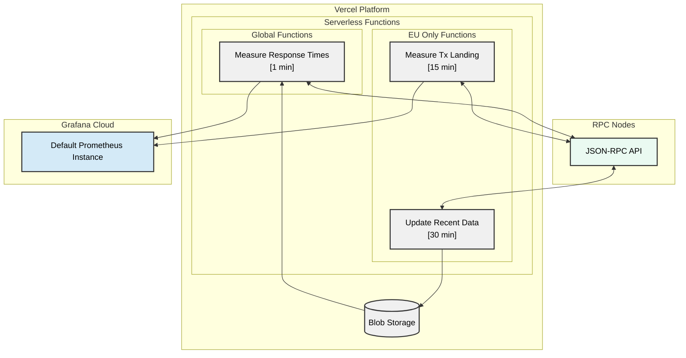

# Chainstack Compare Dashboard

[](https://vercel.com/new/clone?repository-url=https%3A%2F%2Fgithub.com%2Fchainstacklabs%2Fchainstack-rpc-dashboard-functions&env=GRAFANA_URL,GRAFANA_USER,GRAFANA_API_KEY,CRON_SECRET,ENDPOINTS,SKIP_AUTH,METRIC_NAME)

A serverless solution for monitoring RPC nodes response time across different blockchains and regions using Vercel Functions and Grafana Cloud. The project collects metrics from HTTP/WS endpoints for multiple blockchains and pushes them to Grafana Cloud.

📊 [Live Dashboard](https://chainstack.grafana.net/public-dashboards/65c0fcb02f994faf845d4ec095771bd0?orgId=1) | 📚 [Documentation](https://docs.chainstack.com/docs/public-rpc-dashboard)

## Table of Contents
- [Features](#features)
- [System Overview](#solution-overview)
- [Quick Start](#quick-start)
- [Detailed Setup](#detailed-setup)
- [Configuration](#configuration)
- [Development Guide](#development-guide)
- [Technical Reference](#technical-reference)
- [Contributing](#contributing)

## Features

- :chains: Supported blockchains: Ethereum, Base, Solana, TON
- :globe_with_meridians: Multi-region deployment (US, EU, Asia)
- :zap: Real-time metrics collection

## Solution Overview



## Quick Start

### 1. Prerequisites
- Grafana Cloud account
- Vercel account
- GitHub account
- RPC node endpoints

### 2. One-Click Deploy
[](https://vercel.com/new/clone?repository-url=https%3A%2F%2Fgithub.com%2Fchainstacklabs%2Fchainstack-rpc-dashboard-functions&env=GRAFANA_URL,GRAFANA_USER,GRAFANA_API_KEY,CRON_SECRET,ENDPOINTS,SKIP_AUTH,METRIC_NAME)

Configure required environment variables:
   ```env
   GRAFANA_URL=your_grafana_url
   GRAFANA_USER=your_user_id
   GRAFANA_API_KEY=your_api_key
   CRON_SECRET=your_secret
   ```
Deploy!

### 3. Configure RPC Endpoints
Update the `ENDPOINTS` environment variable with your RPC configuration:
```json
{
    "providers": [
        {
            "blockchain": "Ethereum",
            "name": "Provider-Name",
            "region": "Global",
            "websocket_endpoint": "wss://...",
            "http_endpoint": "https://...",
            "data": {}
        }
    ]
}
```
You can leave `data` empty. If a provider has a separate endpoint for sending transactions, use `tx_endpoint` field for that in addition to `http_endpoint`.

## Detailed Setup

### Multi-Region Deployment
1. Create three Vercel projects:
   - `your-project-iad1` (US East)
   - `your-project-fra1` (EU)
   - `your-project-sfo1` (US West)

2. Configure each project:
   ```bash
   # Project Settings → Functions
   Function Region: [Select corresponding region]
   ```

3. Link environment variables:
   ```bash
   # Team Settings → Environment Variables
   Link to all three projects
   ```

### Blob Storage Setup
1. Create a Vercel Blob store
2. Configure storage variables:
   ```env
   VERCEL_BLOB_TOKEN=your_blob_token
   STORE_ID=your_store_id
   ```

### Security Configuration
1. Generate a strong CRON_SECRET
2. Configure authentication:
   ```env
   SKIP_AUTH=FALSE  # Production
   SKIP_AUTH=TRUE   # Development
   ```

## Configuration

### Environment Variables

#### Required Variables
```env
# Grafana Settings
GRAFANA_URL=https://influx-...grafana.net/api/v1/push/influx/write
GRAFANA_USER=your_user_id
GRAFANA_API_KEY=your_api_key

# Security
CRON_SECRET=your_secret
SKIP_AUTH=FALSE

# Metrics
METRIC_NAME=response_latency_seconds
METRIC_REQUEST_TIMEOUT=35
METRIC_MAX_LATENCY=35

# Storage
VERCEL_BLOB_TOKEN=your_blob_token
STORE_ID=your_store_id
```

#### Optional Variables
```env
# Development
VERCEL_ENV=development  # Adds 'dev_' prefix to metrics
SOLANA_PRIVATE_KEY=...  # For Solana write metrics
```

### RPC Provider Configuration
Full configuration options in `endpoints.json`:
```json
{
    "providers": [
        {
            "blockchain": "Ethereum",
            "name": "Provider1",
            "region": "Global",
            "websocket_endpoint": "wss://...",
            "http_endpoint": "https://...",
            "tx_endpoint": "",
            "data": {}
        }
    ]
}
```
You can leave `data` empty. If a provider has a separate endpoint for sending transactions, use `tx_endpoint` field for that in addition to `http_endpoint`.

## Development Guide

### Local Setup
1. Clone and setup environment:
   ```bash
   git clone https://github.com/chainstacklabs/chainstack-rpc-dashboard-functions.git
   cd chainstack-rpc-dashboard-functions
   python -m venv venv
   source venv/bin/activate  # or venv\Scripts\activate on Windows
   ```

2. Install dependencies:
   ```bash
   pip install -r requirements.txt
   ```

3. Configure local environment:
   ```bash
   cp .env.local.example .env.local
   cp endpoints.json.example endpoints.json
   # Update with your values
   ```

4. Run development server:
   ```bash
   python tests/test_api_read.py  # For read metrics
   python tests/test_api_write.py  # For write metrics
   python tests/test_update_state.py  # For state updates
   ```

### Adding New Metrics
1. Create metric class:
   ```python
   from common.metric_types import HttpCallLatencyMetricBase

   class YourMetric(HttpCallLatencyMetricBase):
       @property
       def method(self) -> str:
           return "your_rpc_method"

       @staticmethod
       def get_params_from_state(state_data: dict) -> dict:
           return {"your": "params"}
   ```

2. Register in appropriate handler:
   ```python
   METRICS = [
       (YourMetric, metric_name),
       # ... other metrics
   ]
   ```

## Technical Reference

### Project Structure
```plaintext
├── api/                      # Vercel Functions
│   ├── read/                 # Read metrics
│   ├── write/                # Write metrics
│   └── support/             # Support functions
├── common/                   # Shared utilities
│   ├── base_metric.py       # Base framework
│   ├── factory.py           # Metrics creation
│   ├── metric_*.py          # Configuration
│   └── state/              # State management
├── metrics/                 # Implementations
└── config/                  # Configuration
```

### Metric Types
- **HTTP Metrics**: RPC endpoint response times
- **WebSocket Metrics**: real-time block monitoring
- **Transaction Metrics**: tx processing times

## Contributing

### Getting Started
1. Fork the repository
2. Create feature branch:
   ```bash
   git checkout -b feature/YourFeature
   ```
3. Make changes
4. Run local servers
5. Submit PR

### Code Style
- Follow PEP 8
- Use type hints
- Add docstrings
- Include tests
