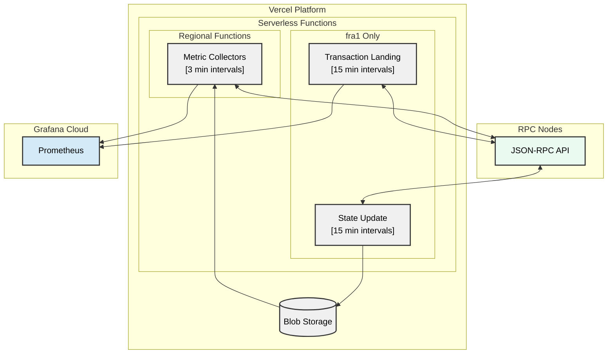

# Chainstack RPC Monitoring Dashboard

A serverless RPC node monitoring system that measures response times across multiple blockchains and regions. Runs on Vercel Functions and pushes metrics to Grafana Cloud.

**[→ Multi-Region Deployment Guide](#multi-region-deployment-guide)**

📊 [Live Dashboard](https://chainstack.grafana.net/public-dashboards/65c0fcb02f994faf845d4ec095771bd0?orgId=1) | 📚 [Documentation](https://docs.chainstack.com/docs/chainstack-compare-dashboard)

## Table of Contents
- [Overview](#overview)
- [Supported Blockchains](#supported-blockchains)
- [Architecture](#architecture)
- [Setup](#setup)
- [Configuration](#configuration)
- [Development](#development)
- [Multi-Region Deployment Guide](#multi-region-deployment-guide)

## Overview

This system collects latency metrics from RPC endpoints using scheduled cron jobs. Functions run in multiple regions (Frankfurt, San Francisco, Singapore, Tokyo) to measure response times from different geographic locations.

**Metric types collected:**
- HTTP RPC method latency (eth_blockNumber, eth_call, eth_getLogs, etc.)
- WebSocket block notification latency (EVM only)
- Transaction landing time (Solana only)

Metrics are pushed to Grafana Cloud in Influx line protocol format for visualization and alerting.

## Supported Blockchains

Ethereum, Base, Arbitrum, BNB Smart Chain, Solana, TON, Hyperliquid, Monad

Each blockchain has region-specific deployment configurations detailed in the [Multi-Region Deployment Guide](#multi-region-deployment-guide).

## Architecture



**Workflow:**

1. State updater fetches latest block and transaction data from RPC endpoints every 15 minutes (fra1 only)
2. State data is stored in Vercel Blob Storage (recent block numbers and transaction hashes)
3. Metric collectors in each region fetch state data and execute RPC calls every 3 minutes
4. Response times are measured and formatted as Influx metrics
5. Metrics are pushed to Grafana Cloud for storage and visualization

## Setup

### Prerequisites

- Grafana Cloud account with Prometheus endpoint
- Vercel account (Pro plan recommended for multi-region deployment)
- RPC node endpoints to monitor

### Deployment

[](https://vercel.com/new/clone?repository-url=https%3A%2F%2Fgithub.com%2Fchainstacklabs%2Fchainstack-rpc-dashboard-functions&env=GRAFANA_URL,GRAFANA_USER,GRAFANA_API_KEY,CRON_SECRET,SKIP_AUTH,SOLANA_PRIVATE_KEY,ENDPOINTS,STORE_ID,VERCEL_BLOB_TOKEN)

For multi-region setup across multiple projects, see the [Multi-Region Deployment Guide](#multi-region-deployment-guide) below.

### Blob Storage Setup

Create a Vercel Blob store and configure the storage variables:

```env
VERCEL_BLOB_TOKEN=vercel_blob_...
STORE_ID=store_...
```

These are required for the state management system.

## Configuration

### Environment Variables

**Required:**

```env
# Grafana Cloud credentials
GRAFANA_URL=https://influx-...grafana.net/api/v1/push/influx/write
GRAFANA_USER=user_id
GRAFANA_API_KEY=glc_...

# Authentication
CRON_SECRET=random_secret_string
SKIP_AUTH=FALSE

# Blob Storage
VERCEL_BLOB_TOKEN=vercel_blob_...
STORE_ID=store_...
```

**Optional:**

```env
# Adds 'dev_' prefix to metric names in non-production environments
VERCEL_ENV=production

# Required only for Solana transaction landing metrics
SOLANA_PRIVATE_KEY=base58_encoded_private_key
```

### RPC Endpoints Configuration

Configure monitored endpoints in the `ENDPOINTS` environment variable (JSON format):

```json
{
  "providers": [
    {
      "blockchain": "Ethereum",
      "name": "Chainstack",
      "websocket_endpoint": "wss://ethereum-mainnet.example.com",
      "http_endpoint": "https://ethereum-mainnet.example.com"
    },
    {
      "blockchain": "Solana",
      "name": "Chainstack",
      "http_endpoint": "https://solana-mainnet.example.com",
      "tx_endpoint": "https://solana-mainnet-tx.example.com"
    }
  ]
}
```

**Fields:**
- `blockchain` - Blockchain name (case-insensitive, must match supported list)
- `name` - Provider identifier (used in metric labels)
- `http_endpoint` - HTTP RPC endpoint URL
- `websocket_endpoint` - WebSocket endpoint URL (optional, use "not_supported" if unavailable)
- `tx_endpoint` - Separate transaction endpoint (Solana only, optional)

For local development, create `endpoints.json` in the project root. For Vercel deployment, set as environment variable.

## Development

### Local Setup

```bash
git clone https://github.com/chainstacklabs/chainstack-rpc-dashboard-functions.git
cd chainstack-rpc-dashboard-functions
python -m venv venv
source venv/bin/activate  # Windows: venv\Scripts\activate
pip install -r requirements.txt
```

### Local Configuration

```bash
cp .env.local.example .env.local
cp endpoints.json.example endpoints.json
```

Edit `.env.local` and `endpoints.json` with your credentials and endpoints.

### Running Tests

```bash
# Test metric collection for a specific blockchain
python tests/test_api_read.py

# Test state update function
python tests/test_update_state.py

# Test Solana transaction landing metrics
python tests/test_api_write.py
```

By default, test scripts import specific blockchain handlers. Modify the import statement in the test file to test different blockchains:

```python
# In tests/test_api_read.py, change:
from api.read.ethereum import handler
# to:
from api.read.monad import handler
```

### Project Structure

```
├── api/
│   ├── read/              # Metric collection handlers (one per blockchain)
│   ├── write/             # Transaction landing metrics
│   └── support/           # State update handler
├── common/
│   ├── base_metric.py     # Base metric classes
│   ├── factory.py         # Metric factory
│   ├── metrics_handler.py # Request handler
│   └── state/             # Blob storage interface
├── metrics/               # Blockchain-specific metric implementations
├── config/
│   └── defaults.py        # Block offset ranges, timeouts, etc.
├── tests/                 # Local development servers
└── vercel.json            # Function and cron configuration
```

### Adding a New Blockchain

1. Create `metrics/{blockchain}.py` with metric implementations:

```python
from common.metric_types import HttpCallLatencyMetricBase

class HTTPBlockNumberLatencyMetric(HttpCallLatencyMetricBase):
    @property
    def method(self) -> str:
        return "eth_blockNumber"

    @staticmethod
    def get_params_from_state(state_data: dict) -> list:
        return []
```

2. Create `api/read/{blockchain}.py` handler:

```python
from common.metrics_handler import BaseVercelHandler, MetricsHandler
from config.defaults import MetricsServiceConfig
from metrics.{blockchain} import HTTPBlockNumberLatencyMetric

METRIC_NAME = f"{MetricsServiceConfig.METRIC_PREFIX}response_latency_seconds"

METRICS = [
    (HTTPBlockNumberLatencyMetric, METRIC_NAME),
]

class handler(BaseVercelHandler):
    metrics_handler = MetricsHandler("YourBlockchain", METRICS)
```

3. Add to `config/defaults.py`:

```python
BLOCK_OFFSET_RANGES = {
    # ...
    "yourblockchain": (7200, 10000),  # blocks back from latest
}
```

4. Add to `api/support/update_state.py`:

```python
SUPPORTED_BLOCKCHAINS = [
    "ethereum", "solana", "ton", "base",
    "arbitrum", "bnb", "hyperliquid", "monad",
    "yourblockchain",  # Add here
]
```

5. Add to `common/state/blockchain_fetcher.py` (EVM chains only):

```python
if blockchain.lower() in (
    "ethereum", "base", "arbitrum", "bnb",
    "hyperliquid", "monad", "yourblockchain",  # Add here
):
    return await self._fetch_evm_data(blockchain)
```

6. Update `vercel.{region}.json` files to include the new blockchain's cron job in appropriate regions.

## Multi-Region Deployment Guide

### Problem

Vercel executes all crons defined in `vercel.json` across all projects/regions, even if the function filters by `ALLOWED_REGIONS`. This wastes cron job slots (40 total limit under the Pro plan).

### Solution

Use region-specific vercel.json files that only define crons for functions that should run in each region.

### Deployment Commands

**Note:** Due to a Vercel CLI bug, the `--local-config` flag doesn't always work correctly. You must copy the region-specific config to `vercel.json` before deploying.

Deploy each project with its region-specific configuration:

```bash
# Germany (Frankfurt - fra1)
vercel link --project chainstack-rpc-dashboard-germany
cp vercel.fra1.json vercel.json
vercel --prod

# US West (San Francisco - sfo1)
vercel link --project chainstack-rpc-dashboard-us-west
cp vercel.sfo1.json vercel.json
vercel --prod

# Singapore (sin1)
vercel link --project chainstack-rpc-dashboard-singapore
cp vercel.sin1.json vercel.json
vercel --prod

# Japan (Tokyo - hnd1)
vercel link --project chainstack-rpc-dashboard-japan
cp vercel.hnd1.json vercel.json
vercel --prod
```

**Important:**
- Always `cp` the region-specific config to `vercel.json` before deploying
- Ensure you're in the correct Vercel project context before deploying (use `vercel link`)
- After deployment, you can restore the original `vercel.json` from git if needed: `git checkout vercel.json`

### Verification

After deployment, verify cron jobs in each Vercel project:

1. Navigate to each project in Vercel Dashboard
2. Go to Settings → Crons
3. Confirm only expected crons are listed

### Updating Region Configuration

To add or remove a blockchain from a region:

1. Update the corresponding `vercel.{region}.json` cron list to add or remove the blockchain's cron entry
2. Redeploy that specific region with the updated config

### Notes

- The original `vercel.json` serves as a reference template
- State Update and Solana Write only run in fra1 to avoid data conflicts
- Each region's config file (`vercel.fra1.json`, etc.) defines only the functions needed in that region
